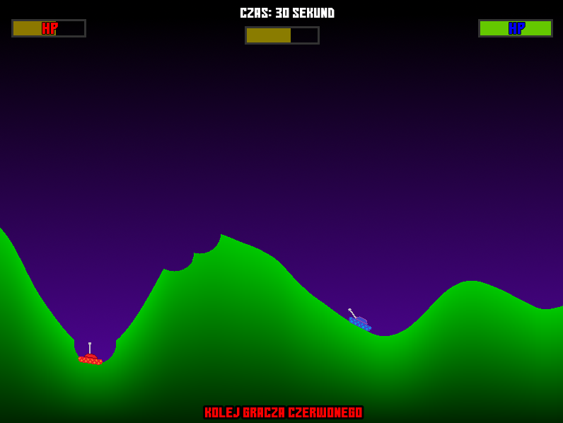

# WarTanks

Gra posiadałaby menu, w którym do wyboru będą następujące opcje:

Play:

      tryb offline - gracze grają na jednej klawiaturze na zmianę
      
      multiplayer - gracze łączą się do serwera, gdy gra wykryje 2 graczy rozpoczyna się rozgrywka
      
      
Settings:

      włącz/wyłącz dźwięk
      
      włącz/wyłącz muzyke
      
      włącz/wyłącz licznik FPS
      
      sterowanie wsad / strzłki
      
Quit:

      zamyka grę
      
W menu będzie można poruszać się zarówno myszką jak i klawiaturą, dodatkowo będzie towarzyszyła nam przyjemna muzyczka, która rozbudzi w nas ducha walki i chęć wygrania z przeciwnikiem.

Mapa za każdym razem będzie generowała się losowo po rozpoczęciu się gry. Do generowania mapy wykorzystamy szum Perlina. W grze będą czołgi, którymi gracze będą mogli poruszać się tylko przez pierwsze 10 sekund po rozpoczęciu się rundy, później mają 20 sekund na oddanie strzału (w tym czasie ustawiają kąt nachylenia lufy czołgu oraz siłę strzału).

Poruszanie nie będzie możliwe dla dużych wzniesień, ze względu na dużą masę czołgu (kąt pod który maksymalnie wjedzie czołg to 75 stopni).

Jeżeli czołg znajdzie się w promieniu wybuchu strzału to straci on punkty życia zależne od odległości między wybuchem a czołgiem.

W przypadku zderzenia się z ziemią pocisk będzie niszczył teren w kształt okręgu, ziemia nie będzie spadała.

Gra zostanie zakończona w momencie, gdy jeden z czołgów zostanie zniszczony. W tym momencie zostaje wyłoniony zwycięzca i jest możliwy powrót do menu.

Do całej gry zostanie dołączony również czat tekstowy, który będzie umożliwiał komunikację się graczy w trybie multiplayer.

# Klasy:
```
Perlin.h
Land.h
Tank.h
Player.h
Game.h
Menu.h
Chat.h
Globals.h
```

