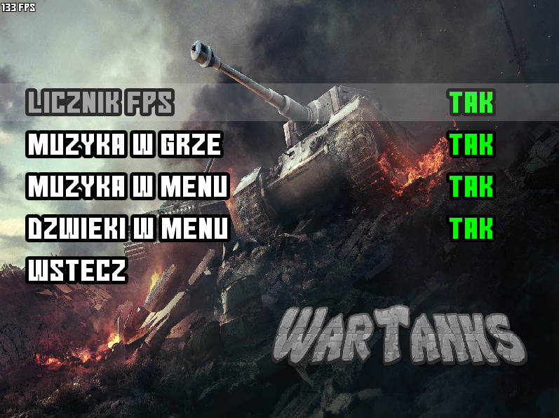
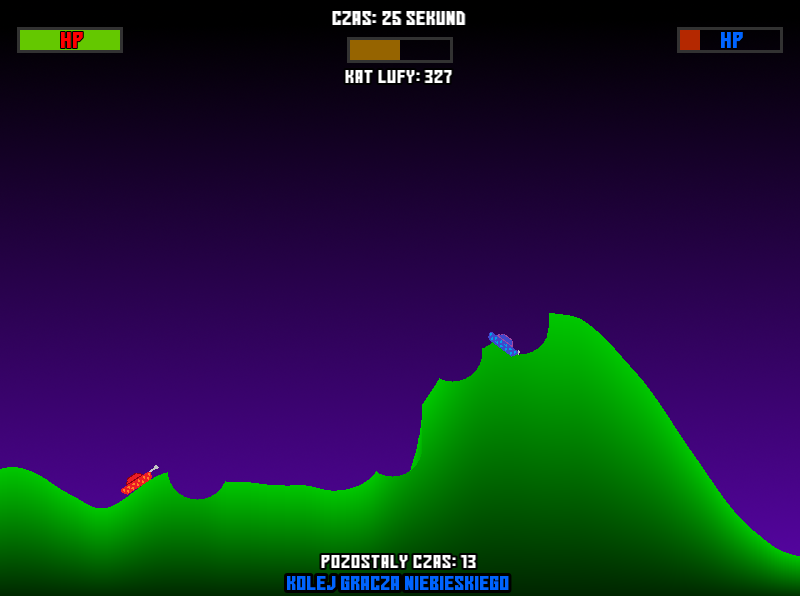

# WarTanks

Gra posiada menu, które posiada następujące opcje:

Graj:

      rozpoczyna grę offline - 2 graczy każdy strzela na zmianę
      
Ustawienia:

      włącz/wyłącz licznik FPS
      
      włącz/wyłącz muzyke w grze
      
      włącz/wyłącz muzyke w menu
      
      włącz/wyłącz dźwięki w menu
      
Wyjście:

      zamyka grę

Po wejściu w aplikację WarTanks pokazuje się menu główne gry oraz odpala się muzyka. Po menu można poruszać się zarówno myszką (LPM wybiera daną opcje) jak i klawiaturą (nawigacja: strzałka w górę oraz strzałka w dół, enter aby wybrać). Wybrana przez nas opcja w menu będzie miała zmieniony odcień aby użytkownik wiedział co wybiera, przy każdej zmianie wyboru towarzyszy nam dźwięk "przeskoku" (typowy dla menu), który można wyłączyć w ustawieniach tak samo jak muzyka w menu czy w grze. W ustawieniach można włączyć również licznik klatek na sekunde, który wyświetla się w lewym górnym rogu.

Po wybraniu opcji "Graj" rozpoczyna się gra. Na mapie pojawiają się 2 czołgi (czerwony i niebieski) o loswej pozycji początkowej, ale zawsze czerwony po lewej, niebieski po prawej. Teren gry generuje się z wykorzystaniem szumu Perlina. Gracze strzelają na zmianę i każdy na oddanie strzału ma 15 sekund. W tym czasie mogą się poruszać, ustawić lufę pod odpowiednim kątem i oddać strzał. W momencie oddania strzału tura automatycznie się kończy i jest kolej drugiego gracza. Po nieoddanym strzale tura danego gracza kończy się.

Gracze mogą zarządzać siłą strzału, gdy przystrzymają strzałkę w górę siła strzału zwiększy się, analogicznie strzałka w dół - zmniejszy się. Siła strzału może wynosić minimalnie 0 i maksymalnie 100 - w zależności wartości zmienia się kolor paska siły, im większa siła tym pasek bardziej zielony, im mniejsza to pasek czerwony - ma to zwrócić uwagę gracza, że gdy wybierze małą siłę strzału to pocisk może uderzyć w jego samego i wiąże się z tym utrata punktów życia.

W rogach gry (lewy górny i prawy górny) pokazany jest pasek punktów życia danego gracza, który również zmienia kolor w zależności od liczby liczby HP. Po środku, na górze ekranu widoczny jest łączny czas gry w sekundach, siła strzału oraz kąt nachylenia lufy. Na dole zaś jest napis, którego gracza jest teraz kolej oraz ile czasu ma na oddanie strzału.

Gracze mogą poruszać się czołgiem lewo (strzałka w lewo) i prawo (strzałka w prawo). Poruszanie nie jest możliwe dla dużych wzniesień i spadków terenu - maksymalny kąt pod który może wjechać czołg to 75 stopni, ale również czołg nie może zjechać gdy spadek wynosi więcej niż 75 stopni.

Aby ustawić kąt nachylenia lufy należy kliknąć LPM, mamy wtedy możliwość jej manewracji w pełnym zakresie (360 stopni), gdy dostosujemy już kąt lufy ponownie klikamy LPM aby zaakceptować. W momencie ustawienia kąta lufy nie można się poruszać! Aby oddać strzał trzeba kliknąć spację. Jeżeli czołg znajdzie się w promieniu wybuchu strzału to straci on 25 punktów życia. W przypadku zderzenia się pocisku z ziemią będzie on niszczył teren w kształt okręgu oraz pokaże się animacjia wybuchu, wisząca ziemia będzie opadała.

Gra zostanie zakończona w momencie gdy jeden z graczy straci wszystkie punkty życia. Istnieją 2 zakończenia gry: wygra jeden z graczy lub będzie remis. W pierwszym przypadku na środku ekranu pokazuje się napis kto wygrał, nad przegranym pokazuje się animacja płomienia, nad zwycięrzcą animacja z fajerwerkami, towarzyszy temu dźwięk wybuchu fajerwerków. W przypadku remisu nie pokazują się żadne animację, ani nie ma dodatkowych dźwięków. W obu przypadkach po 2 sekundach od zakończenia gry na dole ekranu pokazuje się napis "Kliknij enter aby wrócić do menu".

# Klasy:
```
Perlin.h
Land.h
Tank.h
Game.h
Menu.h
Interface.h
Bullet.h
Globals.h
Animation.h
``` 





